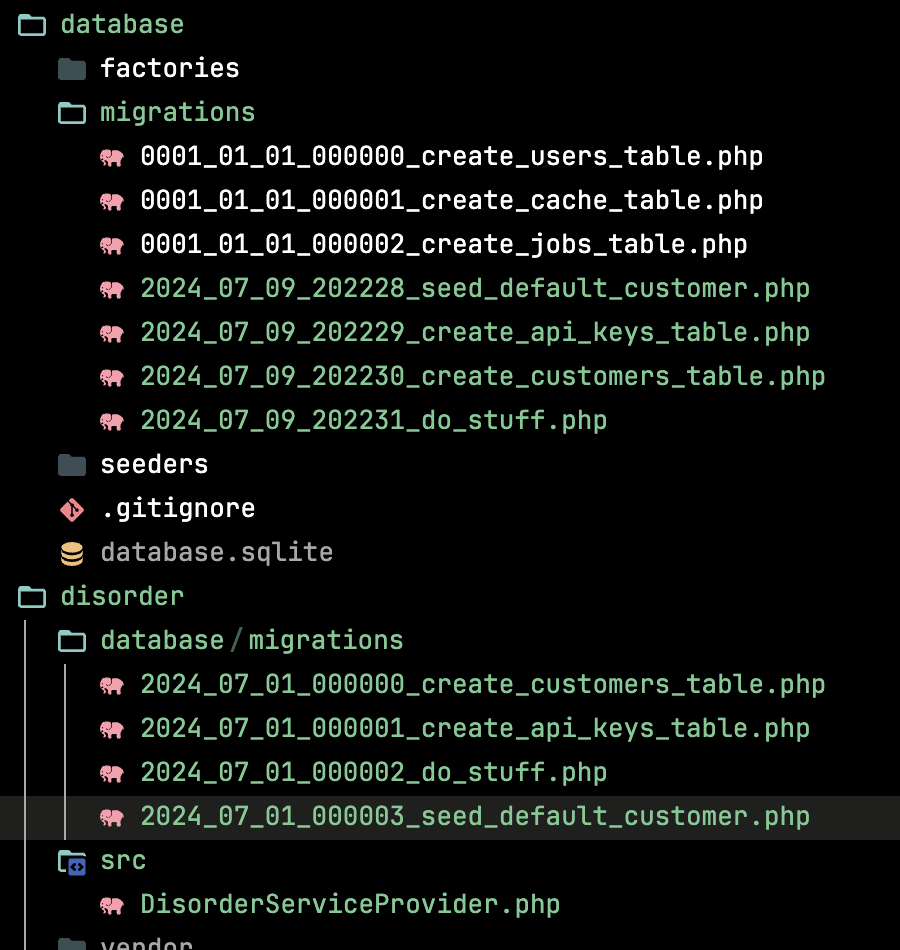

# Migration disorder bug report

When publishing migrations, they are created
in a random order that does not reflect the
intented ordering.

## Quick tour

The laravel app is brand new and generated with `laravel new`.

The only change is the addition of the path repository in `composer.json`
for the package that publishes migrations, along with the composer requirement for that package.

The `./disorder` directory is a package that publishes 3 classic migrations.
They are naturally ordered via valid timestamps. Those are expected to be updated
by laravel during publishing.

Migrations `create_api_keys_table` and `seed_default_customer` both depend on `create_customers_table`,
so running them out of order will fail.

## Installing and trying out

```sh
git clone git@github.com:vorban/migration-disorder-bug-report.git
cd migration-disorder-bug-report
composer install
artisan vendor:publish --tag=disorder
```

The outcome is seemingly random. Here is a screenshot of one attempt that I got:

